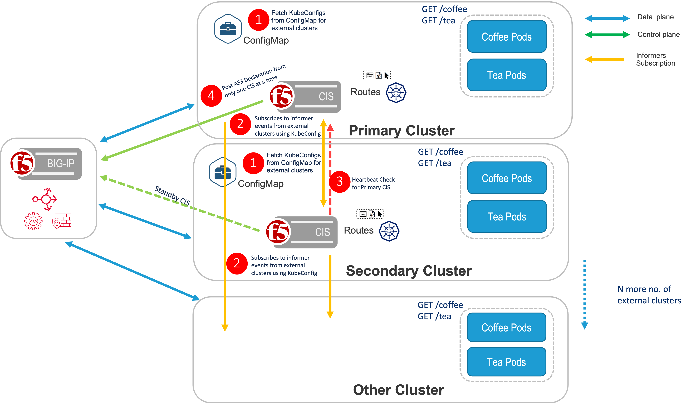
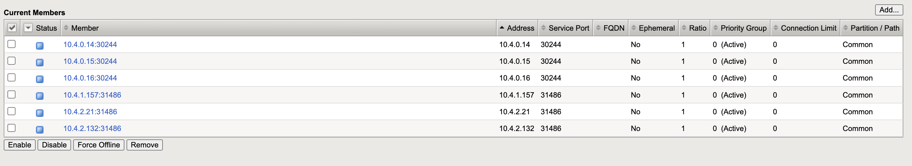
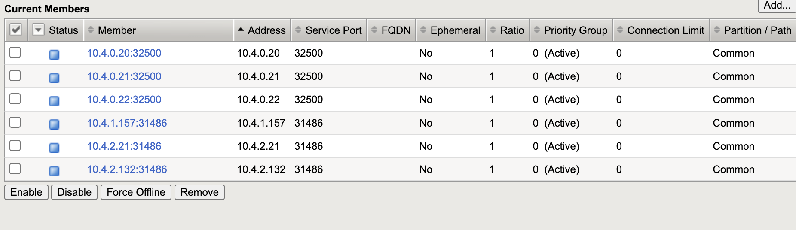

# Multicluster HA CIS with active-standby mode
 
In active-standby mode, the pool members from primary(or current active cluster) as well as members from other remotely monitored clusters are added to virtualservers on BIGIP.

## Architecture



#### Create secret for kubeconfig files of all clusters

1. Create a secret for kubeconfig file of each cluster. This should be done for both primary and secondary clusters.
```bash
kubectl create secret generic <cluster-name> --from-file=kubeconfig=<path-to-kubeconfig-file>
``` 
2. verify the secret is created
```bash
kubectl get secrets
```
output:
```bash
external-cluster           Opaque                                1      53s
primary-cluster            Opaque                                1      16m
secondary-cluster          Opaque                                1      15m
```

### Create ExtendedConfigMap for CIS in both primary and secondary clusters
```bash
kubectl create -f extendedConfigMap.yaml
```

### Deploy CIS in both primary and secondary clusters
1. Create service account for CIS deployments
```bash
kubectl create -f bigip-ctlr-clusterrole.yaml
```
2. Create external cluster rbac for remote cluster monitoring. This is required for all external clusters that are monitored by CIS.
```bash
kubectl create -f external-cluster-rbac.yaml
```
3. Deploy CIS in primary cluster

   Add BIG-IP credentials as Kubernetes Secrets in primary and secondary clusters.
   ```bash
   kubectl create secret generic bigip-login -n kube-system --from-literal=username=admin --from-literal=password=<password>
   ```
   Add custom resource definitions (CRDs) for CIS in primary and secondary clusters.
    ```bash
    kubectl apply -f https://raw.githubusercontent.com/F5Networks/k8s-bigip-ctlr/master/docs/config_examples/customResourceDefinitions/customresourcedefinitions.yml
    ```
   Deploy CIS
   ```bash
   kubectl create -f cis-primary-cluster.yaml
   ```
4. Deploy CIS in secondary cluster
```bash
kubectl create -f cis-secondary-cluster.yaml
```

CIS Deploment [repo](../CIS)

### Deploy application cafe in all Clusters
cafe repo [cafe](../deployments/cafeone)
```bash
kubectl create -f name-cafeone.yaml
kubectl create -f cafe-deployment.yaml
kubectl create -f cafe-service.yaml
```
**output:**

View Service in primary cluster
```bash
kubectl get service -n cafeone
NAME         TYPE       CLUSTER-IP       EXTERNAL-IP   PORT(S)          AGE
coffee-svc   NodePort   172.30.44.113    <none>        8080:30244/TCP   2m18s
mocha-svc    NodePort   172.30.93.232    <none>        8080:30092/TCP   2m18s
tea-svc      NodePort   172.30.187.218   <none>        8080:32392/TCP   2m18s
```
View Service in secondary cluster
```bash
kubectl get service -n cafeone
NAME         TYPE       CLUSTER-IP       EXTERNAL-IP   PORT(S)          AGE
coffee-svc   NodePort   172.30.10.228    <none>        8080:32500/TCP   3m25s
mocha-svc    NodePort   172.30.145.85    <none>        8080:30014/TCP   3m25s
tea-svc      NodePort   172.30.182.242   <none>        8080:30564/TCP   3m25s
```
View Service in external cluster
```bash
kubectl get service -n cafeone
NAME         TYPE       CLUSTER-IP       EXTERNAL-IP   PORT(S)          AGE
coffee-svc   NodePort   10.102.154.97    <none>        8080:31486/TCP   3m40s
mocha-svc    NodePort   10.103.103.248   <none>        8080:31919/TCP   3m40s
tea-svc      NodePort   10.109.19.4      <none>        8080:31562/TCP   3m40s
```
### Deploy Route in primary and secondary clusters
```bash
kubectl create -f route-coffee-edge.yaml
```
View route in primary and secondary cluster
```bash
oc get route -n cafeone
NAME               HOST/PORT                        PATH      SERVICES     PORT   TERMINATION   WILDCARD
cafe-coffee-edge   cafeone.example.com ... 1 more   /coffee   coffee-svc   8080                 None
```
Route repo [route](../routes)

### Results
Verify pool members added from primary which is currently active and external clusters for coffee-svc for route-coffee-edge.yaml



### Failover to secondary cluster
Verify pool members added from secondary cluster(currently active) and external clusters for coffee-svc for route-coffee-edge.yaml


