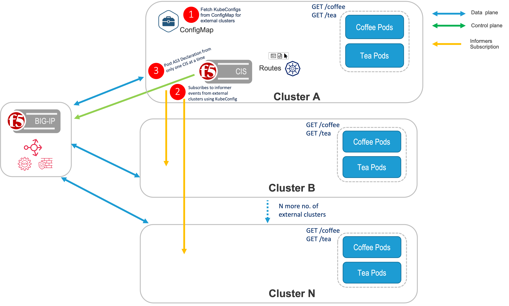
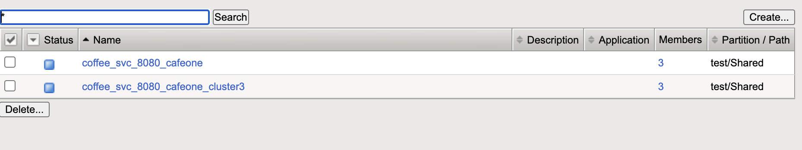

# MultiCluster with standalone CIS
This document demonstrates Multi-Cluster using F5 BIG-IP. This document focuses on standalone deployment using NodePort.
In a Standalone deployment of CIS, CIS is only deployed in one cluster, then create a route resource with a Multi-Cluster annotation or CRD resource with extendedServiceReferences to expose the apps in different OpenShift/K8s clusters.

### Prerequisites

* A openshift/kubernetes cluster to run CIS and application
* An optional external openshift/kubernetes cluster to host the application and distribute the app traffic.



### Create secret for kubeconfig files of external clusters

1. Create a secret for kubeconfig file of external cluster.
```bash
kubectl create secret generic <cluster-name> --from-file=kubeconfig=<path-to-kubeconfig-file>
``` 
2. verify the secret is created
```bash
kubectl get secrets
```
output:
```bash
external-cluster           Opaque                                1      53s
```
### Create ExtendedConfigMap for CIS in local cluster
```bash
kubectl create -f extendedConfigMap.yaml
```
## Deploy CIS in local cluster
1. Create service account for CIS deployment
```bash
kubectl create -f bigip-ctlr-clusterrole.yaml
```
[bigip-ctlr-clusterrole.yaml](../CIS HA/CIS/bigip-ctlr-clusterrole.yaml)
2. Create external cluster rbac for remote cluster monitoring. This is required for all external clusters that are monitored by CIS.
```bash
kubectl create -f external-cluster-rbac.yaml
```
[external-cluster-rbac.yaml](../CIS HA/CIS/external-cluster-rbac.yaml)
3. Deploy CIS
```bash
kubectl create -f cis-deployment.yaml
```
### Deploy application cafe in local and external clusters
cafe repo [cafe](../CIS HA/deployments/cafeone)
```bash
kubectl create -f name-cafeone.yaml
kubectl create -f cafe-deployment.yaml
kubectl create -f cafe-service.yaml
```
**output:**

View Service in local cluster
```bash
kubectl get service -n cafeone
NAME         TYPE       CLUSTER-IP       EXTERNAL-IP   PORT(S)          AGE
coffee-svc   NodePort   172.30.44.113    <none>        8080:30244/TCP   2m18s
mocha-svc    NodePort   172.30.93.232    <none>        8080:30092/TCP   2m18s
tea-svc      NodePort   172.30.187.218   <none>        8080:32392/TCP   2m18s
```
View Service in external cluster
```bash
kubectl get service -n cafeone
NAME         TYPE       CLUSTER-IP       EXTERNAL-IP   PORT(S)          AGE
coffee-svc   NodePort   10.102.154.97    <none>        8080:31486/TCP   3m40s
mocha-svc    NodePort   10.103.103.248   <none>        8080:31919/TCP   3m40s
tea-svc      NodePort   10.109.19.4      <none>        8080:31562/TCP   3m40s
```
### Deploy Route in local cluster
```bash
kubectl create -f route-coffee-edge.yaml
```
View route in local cluster
```bash
oc get route -n cafeone
NAME               HOST/PORT                        PATH      SERVICES     PORT   TERMINATION   WILDCARD
cafe-coffee-edge   cafeone.example.com ... 1 more   /coffee   coffee-svc   8080                 None
```
Route repo [route](../CIS HA/routes)

### Results
Verify pools are created for local cluster and external cluster and pool members are added

