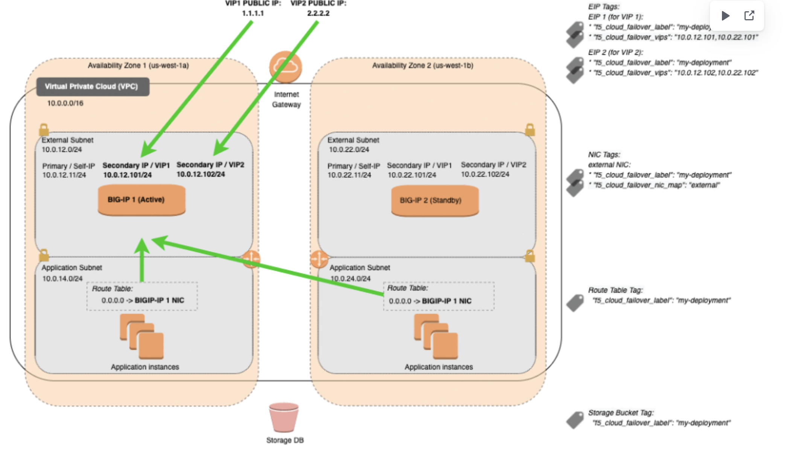
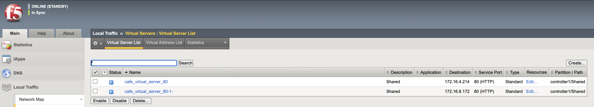

# User Guide for VirtualServer deployed in k8s with BIGIP-HA pair depolyed across different availability zones in AWS.

This document demonstrates how to use CIS with BIGIP-HA pair deployed in different availabilty zones of AWS to Ingress traffic.The diagram below demonstrates this use-case

**Usecase**: For BIGIP HA Active/Passive pair deployed in multiple avaliablilty zones, external/outside IP is different across bigip as they are in different subnets due to multi AZ. As we can see from above diagram, vip is different across bigip1 and bigip2(10.0.12.101 and 10.0.22.101) respectively for VIP1.At failover time, the F5VE moves the EIP(1.1.1.1) correctly to Active BIGIP.
             
**Solution with CIS**: From CIS, virtual server should be added on different vip (10.0.12.101 and 10.0.22.101) for both BIGIP to handle HA. At failover time when EIP is moved to active BIGIP, it is mapped correctly to VIP(external ip) of specific bigip.

**Prerequisite**:

* Configure HA on both bigip deployed across different availabilty zones.More information for configuring bigip HA at https://clouddocs.f5.com/cloud/public/v1/aws/AWS_ha.html

## Configuring virtualserver resource with CIS for HA across BIGIP deployed in multiple az

### create service account for CIS deployments

`kubectl apply -f https://raw.githubusercontent.com/F5Networks/k8s-bigip-ctlr/master/docs/config_examples/rbac/clusterrole.yaml`

### Deploy CIS for each BIG-IP

bigip1
* controller1.yaml [controller1.yaml](controller1.yaml)

bigip2 
* controller2.yaml [controller2.yaml](controller2.yaml)

### Deploy latest supported CRD schema for CIS

`kubectl apply -f https://raw.githubusercontent.com/F5Networks/k8s-bigip-ctlr/master/docs/config_examples/customResourceDefinitions/customresourcedefinitions.yml`

### Deploy virtualserver 

`kubectl apply -f foo-deployment.yaml`

`kubectl apply -f foo-service.yaml`

`kubectl apply -f foo-vs.yaml`

**Note:** 
* virtualServerAddress parameter is used to provide vip(external IP for virtual) on bigip1 and additionalVirtualServerAddresses used to provide vip(external IP for virtual) on bigip2

**Output Config on BIGIP**:

**Note:** As seen in above diagram, on active BIGIP only one virtual server is present with VIP as actual external IP(172.16.8.172) reachable from that BIGIP. But the standby is configured with both BIGIP external IP so that at failover time traffic would still be reachable from external IP(172.16.4.214) i.e reachable on that BIGIP

